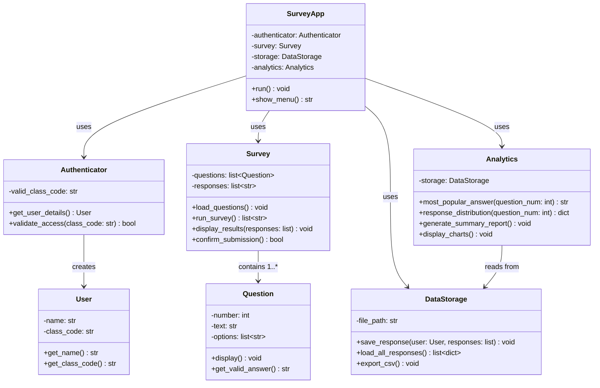
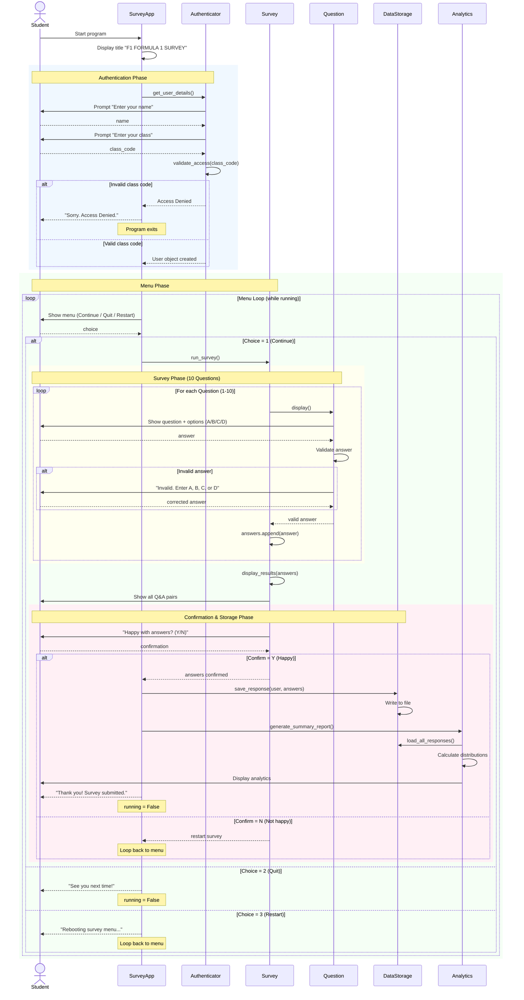

# F1 Survey Analytics — Design Document

## Project Overview

**Project Name:** F1 Survey Analytics
**Author:** Ahan Kesharwani (Class 11SEG261)
**Phase:** Design & Architecture

## What Are We Building?

A Python program that captures student responses about Formula 1 (F1) motorsport — their awareness, preferences, likes, and dislikes — and produces **analytics** from the collected data.

## Goals

| # | Goal | Description |
|---|------|-------------|
| 1 | **Capture Responses** | Run a 10-question multiple-choice survey on F1 topics |
| 2 | **Authenticate Users** | Gate access using a class code so only valid students participate |
| 3 | **Validate Input** | Ensure all responses are valid (A/B/C/D only) |
| 4 | **Store Results** | Persist survey responses to file (CSV/JSON) so data isn't lost |
| 5 | **Generate Analytics** | Analyse response patterns — popularity of teams, knowledge levels, viewing habits |
| 6 | **Display Results** | Show individual results back to the user + aggregated analytics |

## Survey Topics (10 Questions)

1. F1 knowledge level
2. Years watching F1
3. Full seasons watched
4. Preferred high-performing team
5. Preferred mid-performing team
6. Preferred race location
7. Future dominant team prediction
8. Legendary driver pick
9. Dream team to drive for
10. Overall F1 interest level

---

## UML Class Diagram

This diagram shows the **classes and their relationships** for the refactored program. The original code is a flat script — this design breaks it into proper objects.

### Class Responsibilities

| Class | Responsibility |
|-------|---------------|
| **SurveyApp** | Main controller — orchestrates the entire flow (menu, auth, survey, analytics) |
| **Authenticator** | Handles user identification and class code validation |
| **User** | Data object holding student name and class code |
| **Survey** | Manages the 10 questions, collects responses, displays results |
| **Question** | Single question with its text and options; handles input validation |
| **DataStorage** | Saves/loads survey responses to/from file (CSV or JSON) |
| **Analytics** | Reads stored data and generates statistics (popular answers, distributions) |

---

## Sequence Diagram

This diagram shows **how the program flows** from start to finish — the order of interactions between the user and the system components.

### Main Flow — Happy Path (User completes survey)

### Sequence Diagram — What It Shows

| Phase | What Happens |
|-------|-------------|
| **Authentication** | Student enters name + class code → validated against 11SEG261 |
| **Menu** | Student picks Continue, Quit, or Restart |
| **Survey** | 10 questions displayed one-by-one, each answer validated (A/B/C/D only) |
| **Results** | All answers displayed back to the student for review |
| **Confirmation** | Student confirms (Y) to submit or (N) to redo |
| **Storage** | Confirmed answers saved to file (NEW — not in original code) |
| **Analytics** | Aggregated stats generated from all saved responses (NEW — not in original code) |

---

## What's New vs. Original Code

| Feature | Original Code | Refactored Design |
|---------|--------------|-------------------|
| Structure | Flat script, no functions | OOP with 7 classes |
| Data persistence | None (answers lost on exit) | Save to CSV/JSON |
| Analytics | None | Response distributions, popular picks, summary reports |
| Input validation | Inline while loops | Encapsulated in Question class |
| Reusability | Copy-paste to change | Modular — swap questions, storage format, etc. |
| Testability | Not testable | Each class testable independently |

---

## Next Steps

1. ✅ Design phase — UML Class Diagram + Sequence Diagram (this document)
2. ⬜ Implement classes based on this design
3. ⬜ Add data persistence (CSV/JSON storage)
4. ⬜ Build analytics module
5. ⬜ Write unit tests
6. ⬜ Create user documentation
